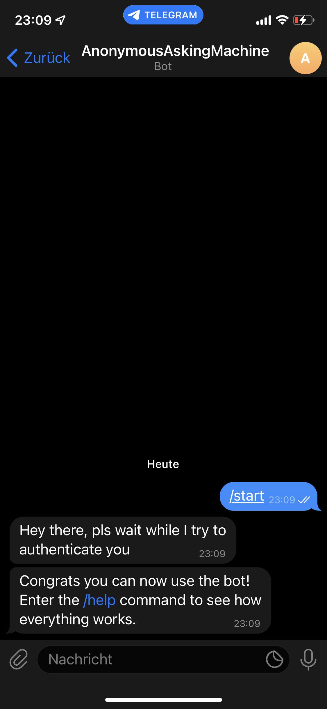
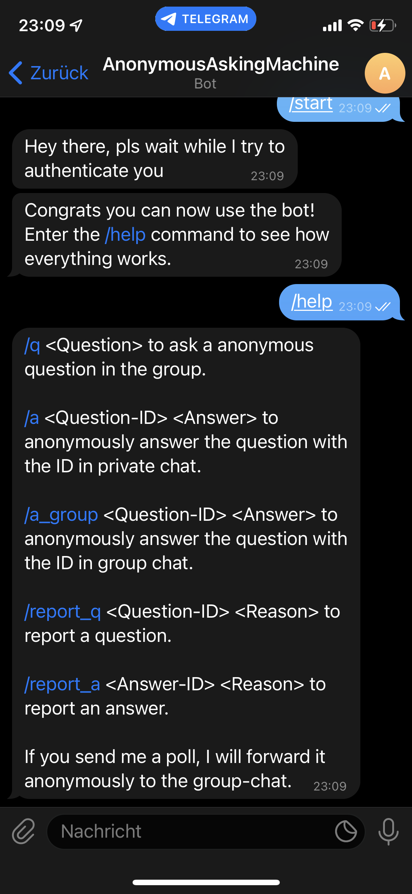
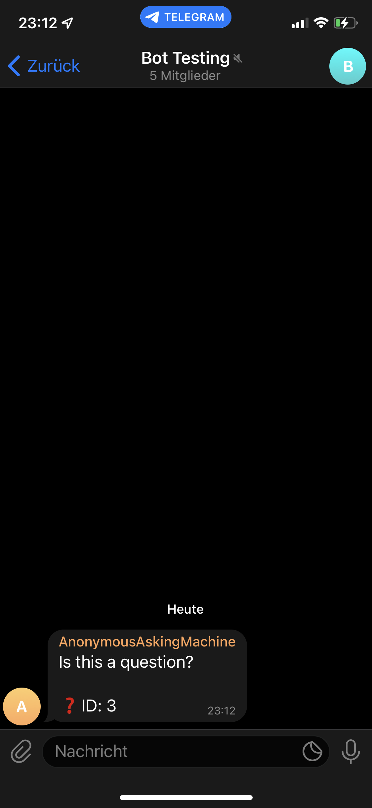
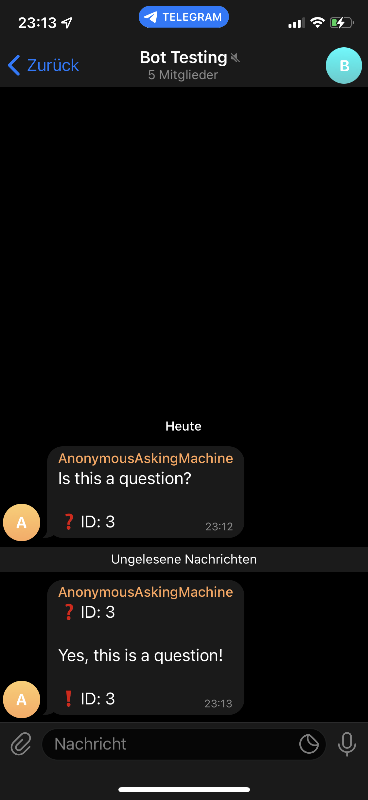
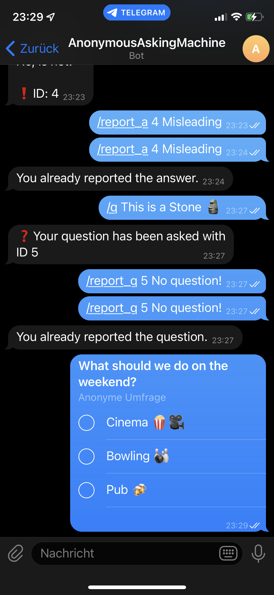
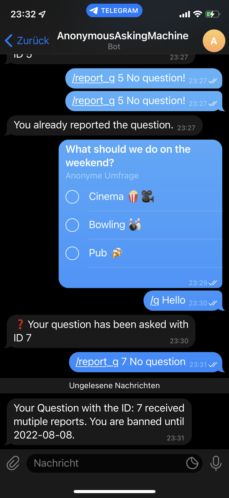

# AnonQnATelegram

## 1. Overview
#### This is the final project of Tim Kapferer, Tim Petersen and Jana Bormann for the course "Basic Python" of the University Osnabrück. <br>
Our goal is to create a bot for Telegram that enables the users to ask and answer questions anonymously in a group chat.
The bot plays the role of an interface between a group member wanting to stay anonymous and the group itself.
To prevent the misuse of anonymity a report system is at hand with a banning mechanism that scales with the size of the group.

## 2. Installation 

First of all you need to have a [Telegram](https://telegram.org/) account and be confortable with using it.<br>  <br>
Then you need to create a bot using the [BotFather](https://core.telegram.org/bots) and save yourself the token for it. <br>
We do recommend to leave the Group Privacy settings on default so the bot can only interact with messages directed specificaly at it. <br> <br>
Now we add the bot to our group, but not too fast! <br>
To make it easy for yourself open this link "https://api.telegram.org/bot<YOUR_TOKEN>/getUpdates" with your token in the placeholder.<br>
Now add your bot to the wanted group just as you would with a normal telegram user. <br>
Afterwards refresh the page and save yourself the group id that can be found inside the json result (Yes the minus infront is also part of it) <br> <br>
Now download this repo and create a .env file in the root folder. <br>
It should look simmilar to this: <br>
```
TELEGRAM_API_KEY = <Your bot token>
GROUP_ID = <The id of the group where the bot operates>
AUTH = <Fallback password if the automatic auth fails>
DB_NAME = <The name of your database>
```
<br>

Before we get to the scripts themself first install the requirements by running ```pip install -r requirements.txt``` in your terminal <br> <br>
Now to create the database where all the information will be stored run all cells in the [DB Notebook](db_management.ipynb) or run the [DB creation script](create_db.py) <br><br>
The only thing left to do is to run the [Main script](main.py) and the bot is up and running!

## 3. How to use the Bot
### The modules that are used with this bot are: <br>
- python-telegram-bot (Python wrapper for Telegram Api)
- sqlite3 (A library to create and interact with databases created in sqlite)
- asyncio (Internal library for asynchronous programming (more on that later))
- python-dotenv (Tools for loading the .env file contents into the environment variables)
<br>
These are all listed in the requirements.txt file <br>

### Bot commands:
- /start Starts interaction with the bot and authorizes the user (if possible)
- /help Shows a help and all possible commands
- /q <Question> to ask a anonymous question in the group.
- /a <Question-ID> <Answer> to anonymously answer the question with the ID in private chat.
- /a_group <Question-ID> <Answer> to anonymously answer the question with the ID in group chat.
- /report_q <Question-ID> <Reason> to report a question.
- /report_a <Answer-ID> <Reason> to report an answer.
- If you send me a poll, I will forward it anonymously to the group-chat.
The commands above are only available when interacting with the bot inside a private chat.
- If you answer on a question inside the group it will be registered as such and forwarded to the questioner
<br>

## 4. Programming Journey
### Additional insights
[libraries, paradigms etc]
### Challenges
[What challenges and how approached]
#### Required Reports
One important aspect of the report system is that the criteria to ban a user must depend on the number of group members. As Telegram groups can have up to 200 000 group members, a simple linear function did not show satisfying results because the number of reports required to ban a user was very low even for larger groups. We choose the integer square root function, since the number of required reports are rising faster for small groups than for the linear function.


### Possible additions
- polls sind bereits drin right?
- special Macht für den admin?
- Sonderregeln beim Geblocktwerden / Dauer etc.?
- Gemeldete Frage wird gelöscht?
- Bot in mehreren Gruppen?
- noch anderer krasse Bot Statistiken für den admin einsehbar?

## 5. Results
[screenshots Frage gestellt + beantwortet, user blocken etc]



The /start command authenticates the user by insert the user data into the table USER. <br>

The /help command shows the most important commands and explains how to make anonymous polls. <br>

After a user ask a question the bot forwarded it anonymously to the group.<br>

Another user give an anonymous answer to the group.<br>

Send a poll to the bot, and the bot will forward the poll to the group anonymously.<br>

That's how the poll looks like in the group.<br>


If a user receives multiple reports, the user might receive a ban.

