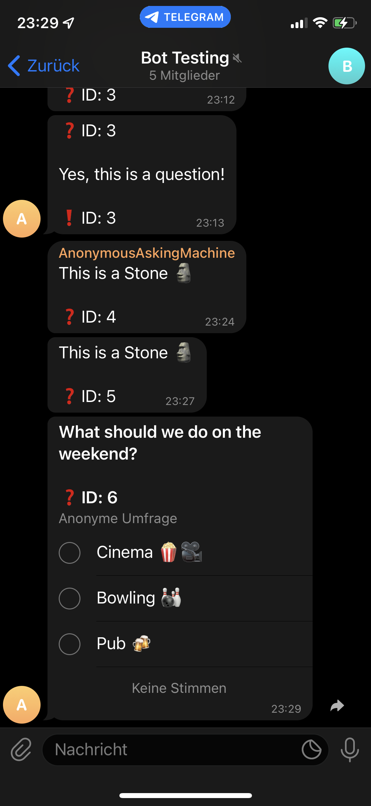

# AnonQnATelegram

## 1. Overview
#### This is a project by Tim Kapferer, Tim Petersen and Jana Bormann. <br>
Our goal is to create a bot for Telegram that enables the users to ask and answer questions anonymously in a group chat.
The bot plays the role of an interface between a group member wanting to stay anonymous and the group itself.
To prevent the misuse of anonymity a reporting system is at hand with a banning mechanism that scales with the size of the group.

## 2. Installation 

First of all, you need to have a [Telegram](https://telegram.org/) account and be comfortable with using it.
Also, installed [Python](https://python.org) 3.9 is needed<br>  <br>
Then you need to create a bot using the [BotFather](https://core.telegram.org/bots) and save yourself the token for it. <br>
We do recommend to leave the Group Privacy settings on default so the bot can only interact with messages directed specifically at it. <br> <br>
Now we add the bot to our group, but not too fast! <br>
To make it easy for yourself open this link "https://api.telegram.org/bot<YOUR_TOKEN>/getUpdates" with your token in the placeholder.<br>
Now add your bot to the wanted group just as you would with a normal telegram user. <br>
Afterwards refresh the page and save yourself the group id that can be found inside the json result (Yes the minus in front is also part of it) <br> <br>
Now download this repo and create a .env file in the root folder. <br>
It should look similar to this: <br>
```
TELEGRAM_API_KEY = <Your bot token>
GROUP_ID = <The id of the group where the bot operates>
AUTH = <Fallback password if the automatic auth fails>
DB_NAME = <The name of your database>
```
<br>

Before we get to the scripts themself first install the requirements by running ```pip install -r requirements.txt``` in your terminal <br> <br>
Now to create the database where all the information will be stored run all cells in the [DB Notebook](db_management.ipynb) or run the [DB creation script](create_db.py) <br><br>
The only thing left to do is to run the [Main script](main.py) and the bot is up and running!

## 3. How to use the Bot
### The modules that are used with this bot are: <br>
- python-telegram-bot (Python wrapper for Telegram Api)
- sqlite3 (A library to create and interact with databases created in sqlite)
- asyncio (Internal library for asynchronous programming (more on that later))
- python-dotenv (Tools for loading the .env file contents into the environment variables)
<br>
These are all listed in the requirements.txt file <br>

### Bot commands:
- /start Starts interaction with the bot and authorizes the user (if possible)
- /help Shows a help and all possible commands
- /q <Question> to ask an anonymous question in the group.
- /a <Question-ID> <Answer> to anonymously answer the question with the ID in private chat.
- /a_group <Question-ID> <Answer> to anonymously answer the question with the ID in group chat.
- /report_q <Question-ID> <Reason> to report a question.
- /report_a <Answer-ID> <Reason> to report an answer.
- If you send me a poll, I will forward it anonymously to the group-chat.
The commands above are only available when interacting with the bot inside a private chat.
- If you answer a question inside the group it will be registered as such and forwarded to the questioner
<br>

## 4. Programming Journey

By wanting to create a telegram bot we first had to gather a lot of information to understand what we would need to do, how the bot system works etc. The starting point for that was the official [Telegram Api website](https://core.telegram.org/bots/api) where we learned about the bot ecosystem and how to create/manage a bot. <br>
We learned to control the bot by http requests using a browser and the identifier token of the bot, which was good to get a first grasp of what can be done, how information is processed and displayed and so on. <br> <br>
This was all nice but to be able to write a functioning bot we needed to have a way to use the Api through Python. This is where [python-telegram-bot](https://python-telegram-bot.org/) comes in. <br>
It is a wrapper implementation which makes the telegram api accessable in Python using the same names as the original Api. There are two ways to control a bot with this library, one is to do exactly like the documentation of the Api says, the other (mostly the better) is to use their own convenience implementation (mostly using telegram.ext in the code) which makes the bot interaction more "pythonic" and easier interactable for most programmers. <br>
Working through the [Wiki](https://github.com/python-telegram-bot/python-telegram-bot/wiki/) we learned how to send messages, react to commands etc. <br>
This was about the most challenging part in getting to know the whole bot-ecosystem, but it was still unusual to work with async functions because this changes the whole idea and structures to write code. Therefore we needed to get a deeper view into [asynchronous programming](https://youtu.be/t5Bo1Je9EmE) (in Python) and its [delineation to multithreading](https://stackoverflow.com/questions/34680985/what-is-the-difference-between-asynchronous-programming-and-multithreading). Since these concepts are kind of hard to grasp at first glance after only writing code in a synchronous way this again took some time to get used too. <br><br>
After understanding the whole interaction with the bot and its underlying principles we were faced with the problem of how to save our data (Questions, Answers, etc...). Fortunately Python itself has (since 2.5) [SQLite](https://towardsdatascience.com/do-you-know-python-has-a-built-in-database-d553989c87bd) preinstalled which made the part fairly easy after learning the basics of SQL. Now we had a working bot which can forward questions, has an answer system and can serialize everything inside a database. <br>
Next we needed to implement the report system; this is important since one of the key problems with anonymity is misuse of that to offend or spam.

One important aspect of the report system is that the criteria to ban a user must depend on the number of group members. As Telegram groups can have up to 200 000 group members, a simple linear function did not show satisfying results because the number of reports required to ban a user was very low even for larger groups. We choose the integer square root function,
 since the number of required reports are rising faster for small groups than for the linear function. 
<br>
The last problem we encountered was that since the bot is working completely asynchronous, there was the possibility of multiple access on the same db tables and changes to them. To prevent this we needed to make our db-access so called thread-safe. In Python we can achieve this by only accessing the database using ```with lock_object:``` blocks. Our lock object being "con" since it is the connection to the database itself, the program now lets only one function at a time work on the database. Only if the function steps out of the "with" block the so called monitor is free again and another function can access the db to read or write data. This now allows many users to access the bot at the same time without the problem of lost updates or errors.


### Possible additions for the future
- We already added polls in the way that one can forward them usingthe bot, but the interaction could be extended
- special commands and interfaces for the group admins to manually ban, unban and change settings of the bot
- Finetuning of the parameters for banning, reporting, etc.
- Make the bot available to more groups and implement multi-threading
- interface for admins to view statistics and usage

## 5. Results
[screenshots Frage gestellt + beantwortet, user blocken etc]


The /start command authenticates the user by insert the user data into the table USER. <br>

The /help command shows the most important commands and explains how to make anonymous polls. <br>

After a user ask a question the bot forwarded it anonymously to the group.<br>

Another user give an anonymous answer to the group.<br>

Send a poll to the bot, and the bot will forward the poll to the group anonymously.<br>

That's how the poll looks like in the group.<br>


If a user receives multiple reports, the user might receive a ban.

